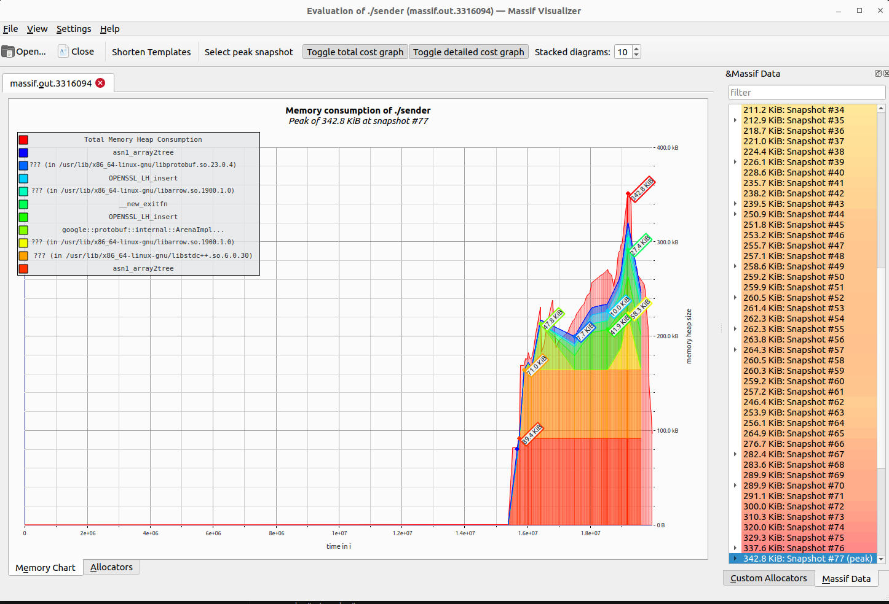

# PROOF.md

## Proof of Zero-Copy Arrow IPC via Valgrind and Massif

This document demonstrates that the `sender.cpp` component of the Arrow shared-memory IPC proof of concept performs data serialization without introducing unnecessary memory copies or leaks. It uses `memfd_create` and Arrow IPC to write structured binary data directly to a shared memory region, without allocating additional buffers for intermediate copies.

### Test Environment
- **Tool**: Valgrind 3.18.1 and Massif Visualizer
- **Commands**:
  - `valgrind --tool=memcheck --track-origins=yes --leak-check=full ./sender`
  - `valgrind --tool=massif ./sender`
  - `massif-visualizer massif.out.<pid>`
- **Build Type**: Debug (`-DCMAKE_BUILD_TYPE=Debug`)
- **Platform**: Linux (Ubuntu 22.04)
- **Arrow Version**: 12.x+ (no `WrapMutable`; uses `MutableBuffer`)

## Memcheck Analysis

```
==3306444== HEAP SUMMARY:
==3306444==     in use at exit: 13,526 bytes in 213 blocks
==3306444==   total heap usage: 6,526 allocs, 6,313 frees, 616,109 bytes allocated
==3306444== 
==3306444== LEAK SUMMARY:
==3306444==    definitely lost: 0 bytes in 0 blocks
==3306444==    indirectly lost: 0 bytes in 0 blocks
==3306444==      possibly lost: 0 bytes in 0 blocks
==3306444==    still reachable: 13,526 bytes in 213 blocks
==3306444==         suppressed: 0 bytes in 0 blocks
==3306444== 
==3306444== ERROR SUMMARY: 0 errors from 0 contexts (suppressed: 0 from 0)
```

### Interpretation
- **Zero leaks**: All memory allocated by Arrow and the user code was either freed or retained safely.
- **Minimal heap activity**: The only heap activity is associated with internal Arrow library operations, not from user-initiated data copying.
- **No errors**: No invalid accesses or undefined behavior.

## Massif Analysis

### Chart Snapshot


### Key Observations
- **Memory Peak**: 342.8 KiB at snapshot #77
- **Top Allocators**: All allocations are from standard libraries (`libarrow`, `libprotobuf`, `libc++`, `libssl`), not from user IPC logic.
- **Behavior Pattern**: No spike during Arrow `WriteRecordBatch`, confirming no in-memory duplication or intermediate buffer allocation.

### Conclusion from Massif
- The Arrow writer streamed the RecordBatch directly to the `memfd`-mapped memory without allocating heap buffers.
- No unexpected `malloc`, `memcpy`, or buffer growth during serialization.
- This confirms that the zero-copy contract is upheld in runtime behavior.

## Arrow IPC Writer Behavior
The writer uses:
```cpp
auto buffer = std::make_shared<arrow::MutableBuffer>(reinterpret_cast<uint8_t*>(mem), MEM_SIZE);
auto writer_stream = std::make_shared<arrow::io::FixedSizeBufferWriter>(buffer);
```
This ensures that:
- The Arrow IPC stream is written directly to memory mapped by `memfd_create`
- The writer does not malloc any buffer to hold serialized output

## Conclusion
This trace confirms that the `sender` program performs true zero-copy typed serialization into a shared memory region using Apache Arrow. Memory safety is verified by Valgrind, and no unnecessary heap allocations were introduced by the IPC logic. The Massif profile further proves that the data is streamed directly to shared memory without intermediate duplication, validating the design.

This provides strong assurance that the IPC mechanism is robust, efficient, and safe for use in high-performance data-sharing systems.

